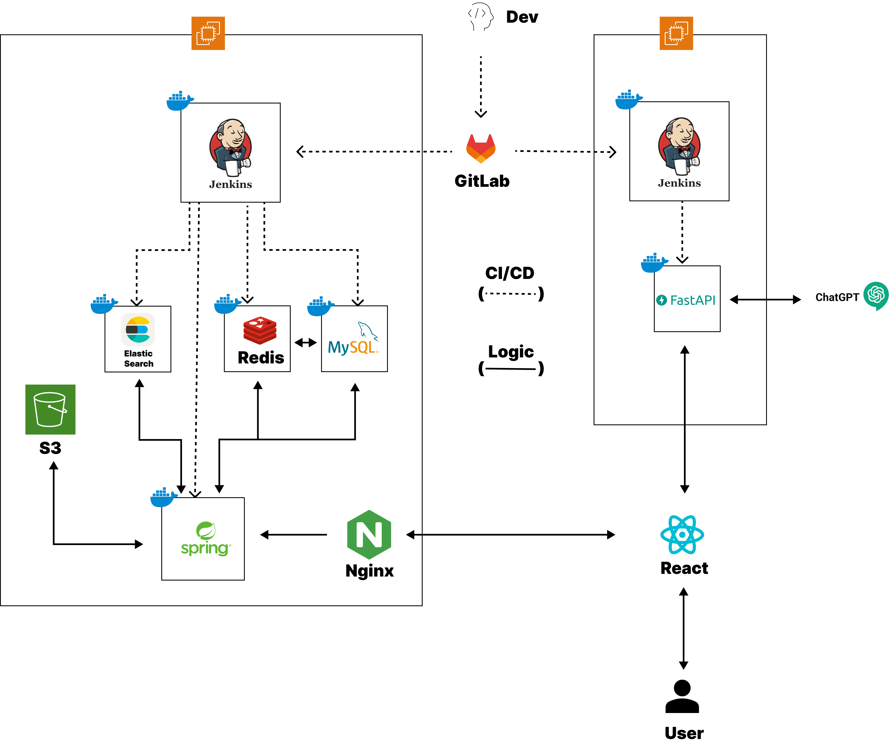
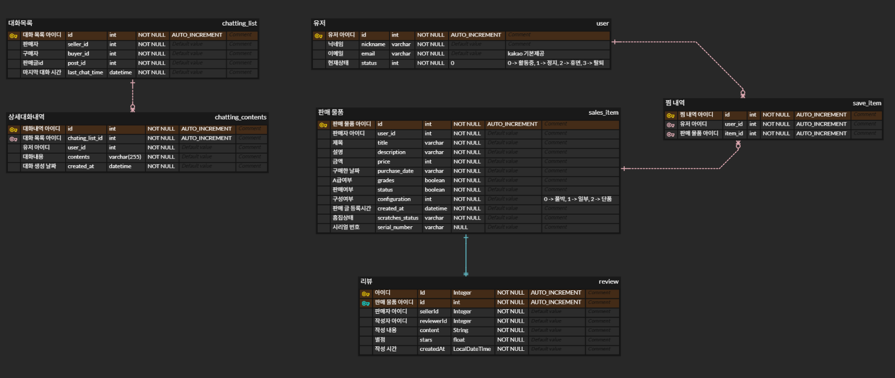
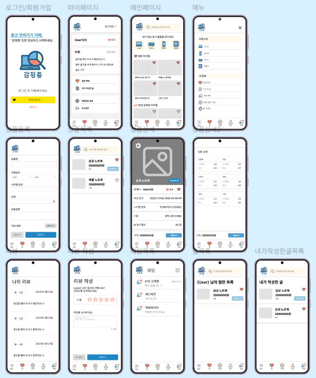

# 감정중

## https://gamjeongjung.co.kr
## 1️⃣ 서비스 소개

### 개요

- 전자기기 중고거래 플랫폼
- AI 기반 흠집 탐지 및 게시글 자동 생성성
- 서비스명 : 감정중

### 타겟층 🎯

- 중고 전자기기를 판매하고 구매하는 모든 사람

### UCC 📽️

### Presentation 📕

 

## 2️⃣기획 배경

### 배경

- 온라인 중고거래 구매 후, 나도 몰랐던 **흠집**이 있었다 ! 😢 미리 알려줘야 하는거 아닌가❓
- **전자기기에 하자가 어딨는지 꼼꼼히 확인하기 힘들어..**😨 

👉 그래서 **AI가 흠집 탐지도 해주고! 게시글도 자동 생성해주는 감정중**이 탄생했습니다! 💙

### 목적 ✅

전자기기 중고거래 판매자/구매자들의 편리성과 신뢰성을 가진 서비스를 만들자‼️

 

## 3️⃣기능 소개

### 📌AI기반 전자기기 촬영 각도 분류 기능
- 전자기기 촬영 후 전면/측면/후면 자동 분류
- 
---

### 📌AI기반 전자기기 흠집 탐지 기능
- 전자기기 전면/측면/후면의 흠집 탐지 후 흠집 개수 및 위치 안내
- 
---

### 📌AI기반 판매 게시글 자동 생성 
- 간단 정보 입력 후 상세 정보를 AI가 작성해주는 판매 게시글 
---

### 📌판매자/구매자 간 실시간 채팅 기능 
- 실시간 통신  
- 메세지 수신유무 상태 파악 

## 4️⃣기술 스택
### BackEnd
- Java
- Python
- Spring Boot
- Spring JPA
- MySQL
- Redis
- Web Socket
- Elastic Search
- Amazon S3

### Frontend
- VisualStudioCode
- Node.js
- NPM
- TypeScript
- Tailwindcss
- PWA
- React
- Axios
- Zustand

### Infrastructure
- Gitlab WebHook
- Docker
- Jenkins
- Nginx
- Amazon EC2

## 5️⃣핵심 기술
### ✔️Web Socket : STOMP (메시지 브로드캐스팅)
1. 실시간 채팅 기능 제공
- 상대방과의 실시간 소통
  -게시글에 있는 채팅버튼을 눌러 채팅 시작

- 읽음 처리를를 통해 상대가 메시지를 읽었는지 확인 가능
  - 채팅 과정에서 메시지의 type을 MESSAGE, RECEIVE로 구분
    - MESSAGE : 상대방에게 메시지를 전송했을 때
    - RECEIVE : 상대방이 보낸 메시지를 읽었을 때, 채팅방에 처음 접속했을 때
    - RECEIVE를 기준으로 읽음 처리 구현

  - 채팅방에 처음 접속했을 때 상대방이 마지막으로 접속한 시간 저장
   - 채팅방의 메시지 내역에 있는 메시지들의 시간과 상대방의 마지막 접속 시간을 비교
    - 접속시간보다 이전에 온 메시지들은 읽음 처리

- 읽지 않은 메시지 -> 알림배지
  - 채팅 목록에 5초 간격의 폴링을 통해 읽지 않은 메시지 로드 기능
    - 서버 측으로부터 채팅방마다 읽지 않은 메시지 개수를 수신
    - 읽지 않은 메시지 개수를 채팅방마다 배지로 표시

  - 네비게이션 바 역시 폴링을 통해 어느 페이지에서든지 새로 온 메시지가 있으면 확인 가능
  - 채팅 목록과 동일한 API호출을 통해 읽지않은 메시지 개수를 수신 받음
  - 채팅방마다 읽지 않은 메시지 개수를 전부 합하여 네비게이션 바의 메시지 아이콘에 배지로 표시

3. 사용한 채팅 방식 : STOMP
- url : [https://gamjeongjung.co.kr/ws]
  - socketjs를 사용시 위의 url로 사용
  - socketjs 미사용시 : [wss://gamjeongjung.co.kr]
- /topic을 destination 헤더로 넣어 메시지 브로커를 통해 메시지를 구독자들에게 곧바로 브로드캐스팅

  - -> 서버 가공 후 /topic 경로로 메시지 전송
    - 메시지 : type, text, createdAt, receivedAt 등의 정보를 가지고 있음
  - -> 메시지 브로커
  - -> /topic 구독자에게 메시지 전송
### ✔️Elastic Search
1. 검색 엔진 제공
- 유연한 검색 기능
2. 
- 
### ✔️AI 

1. 
- 
2. 
- 

 

 

## 6️⃣서비스 아키텍처

 

## 7️⃣프로젝트 산출물
### 📌 ERD

---

---

### 📌Figma

---

### 📌 API 문서
[KaKao Login API](https://developers.kakao.com/docs/latest/ko/kakaologin/rest-api)
